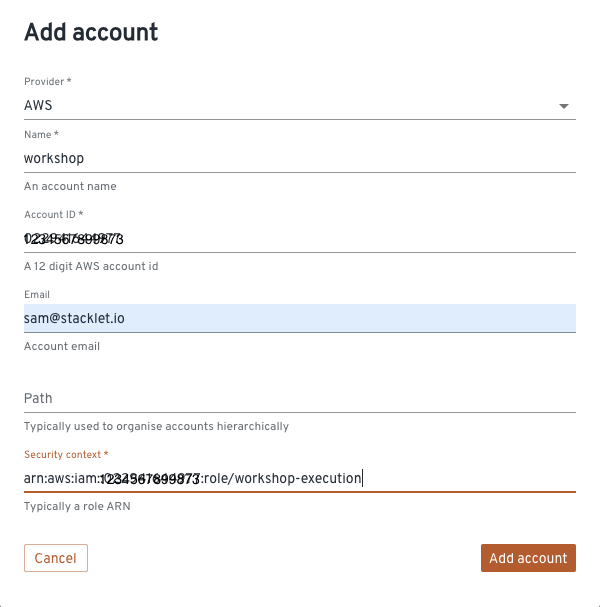

# Laptop / Workstation Setup

## Download this repository

Clone the repository used for the workshop:

```$ git clone https://github.com/stacklet/aws-workshop```

## Install basic tooling

- Python: Make sure that you run Python 3.11 or above. Stacklet recommends using [pyenv](https://realpython.com/intro-to-pyenv/) to manage multiple Python versions on the same system. 

## Install and Configure the AWS CLI v2

Install the [AWS CLI v2](https://docs.aws.amazon.com/cli/latest/userguide/getting-started-install.html)

For this workshop, an AWS Account has been allocated to you and credentials shared

Follow [this guide](https://docs.aws.amazon.com/cli/latest/userguide/cli-chap-configure.html) to get started and create a default profile that all the tools will be able to use. 

## Install Terraform

Install [Terraform](https://developer.hashicorp.com/terraform/tutorials/aws-get-started/install-cli)

## Install Cloud Custodian Runtime and Shift Left

Install the main [Cloud Custodian CLI](https://cloudcustodian.io/docs/quickstart/index.html) then also install [C7n Left](https://cloudcustodian.io/docs/tools/c7n-left.html#install)

# Platform Enablement

You have been assigned a Stacklet Platform, which comes with a parameter `Destination Account`. 

Deploy the [CloudFormation template](./stacklet.cfn.yaml) in your assigned AWS Account in a couple of regions including `us-east-1`: 

```shell
aws --region us-east-1 cloudformation deploy \
    --template-file stacklet.cfn.yaml \
    --parameter-override DestinationAccount=<DestinationAccountID> DestinationPrefix=ws-<DestinationAccountID> \
    --capabilities CAPABILITY_NAMED_IAM \
    --stack-name StackletEnablement

aws --region us-east-2 cloudformation deploy \
    --template-file stacklet.cfn.yaml \
    --parameter-override DestinationAccount=<DestinationAccountID> DestinationPrefix=ws-<DestinationAccountID> \
    --capabilities CAPABILITY_NAMED_IAM \
    --stack-name StackletEnablement
```

Then extract outputs from the stack to configure the platform: 

```shell
aws --region us-east-1 cloudformation describe-stacks \
    --stack-name StackletEnablement \
    --query 'Stacks[0].Outputs[?OutputKey == `ExecutionRoleArn`].OutputValue'   
```

Keep a trace of that result. 

Connect to the console `console.ws-<DestinationAccountID>.workshop.stacklet.io` with the username and password that have been shared with you earlier, and browse to `Admin > Accounts`. Hit the `Add Account` button to immediately onboard the account you just enabled. 



Use the output of the CloudFormation stack as the `Security Context`. 

[Next Step](../01-policy-authoring/README.md) | [Back to Top](../README.md)