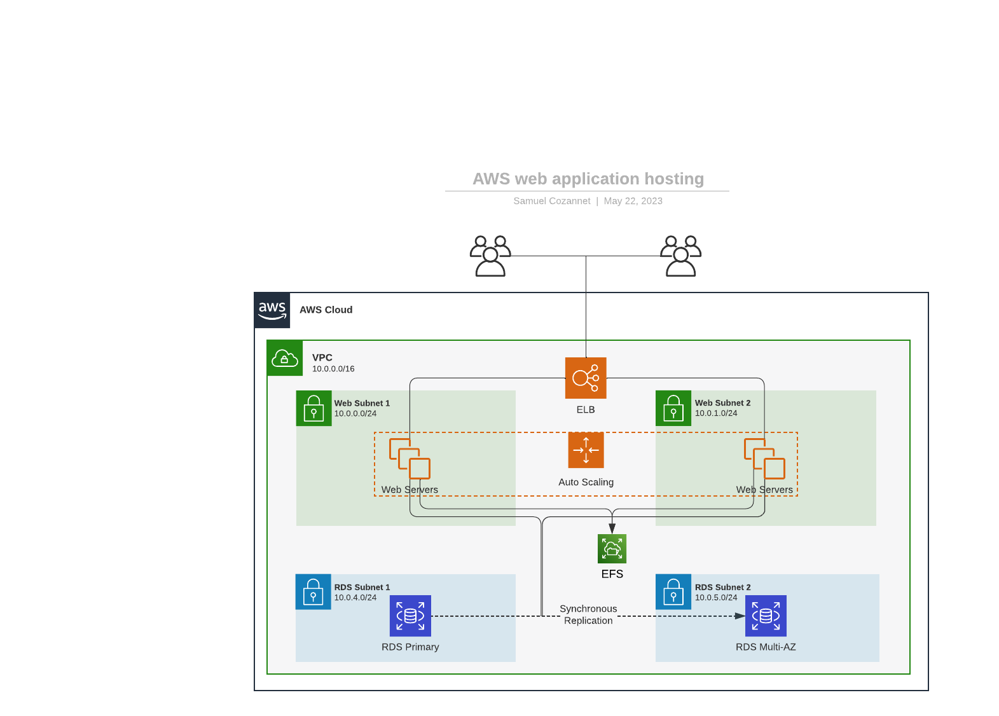

# Authoring Policies

**Note**: This workshop is not a security discussion. Instead, overly simplify use cases to focus on the workflow. We understand that security suggestions made here are far from perfect. 

## Before you start

The code for this section is available in the folder `01-policy-authoring` and its subfolders. Make sure to browse to that folder to run the commands indicated below

```shell
cd 01-policy-authoring
```

## High Level Design 

As a member of the security team your mission is to help other developers consider security throughout the lifecycle of their applications. Said otherwise, security starts in the pipeline. 

You are tasked with proposing a security framework for the new blog. You start by researching at the different components and their potential security options. At this stage of the development, ACME, inc. is really just looking at enabling further experimentation by the product team. The infrastructure is far from production-readiness, but is representative of what will happen in higher environments.

The team has come up with an early internal proposal: 



This informs you that the main building block in the solution will be

* AWS ELB to serve the frontend
* AWS Autoscaling Group & AWS EC2 instances to serve the application
* AWS RDS as a database backend
* AWS EFS as a common storage backend between web servers

As the solution matures, additional components will appear. This is already a great start.

## Non Functional Requirements

Armed with this list of AWS Services to secure, you start evaluating company policies that must apply against these resource types. 

* Everything that can be encrypted must be encrypted, in flight and at rest
* Bad headers must never reach the application
* Databases shall not use the default communication port
* Under no circumstances should anyone by able to SSH into an instance from the internet

## Translation into IaC Policies

IaC controls are extremely useful in organizations using Terraform as their primary infrastrcture tool. IaC code that is not compliant with one or more policies can be intercepted pre-commit (on developer laptop), pre-merge (in CI pipeline) or pre-deploy (in CD pipeline) and denied moving forward. 
This guarantees that everything that the application is compliant with ACME.inc's guardrails when you deploy it. 

The workflow to generate more IaC policies is the following: 

For each resource type required by the solution:
    Read the documentation for the Terraform module. For example, the [EFS Drive docs](https://registry.terraform.io/providers/hashicorp/aws/latest/docs/resources/efs_file_system)
    Identify structures that match the control intent. For example in EFS Drive docs, we can see there is an "encrypted" attribute that we need to set to `true` to make sure that all EFS drives that get deployed are encrypted with at least the default AWS KMS Key. 
    Write matching policies
    Test Policies

Let's do just one of these: 

The EFS module will look like: 

```terraform
resource "aws_efs_file_system" "efs" {
  creation_token = "${var.prefix}-${var.environment}-efs"
  encrypted      = true
}
```

Since encrypted is false by default, our policy shall check for an encrypted attribute being absent, empty or false. A solution is

```yaml
policies:
- name: efs-not-encrypted
  description: Elastic File System (EFS) must be encrypted
  resource: terraform.aws_efs_file_system
  filters:
  - or:
    - encrypted: empty
    - encrypted: false
    - encrypted: "false"
```

You can repeat the operation for other services. Once all the policies are written, they can be shared in repository templates, so that developers inherit them automagically everytime they start a new project. 

Testing policies is a mandatory step that serves two purposes: 

1. Make sure that the policy behave as expected
2. Provide documentated guidelines for developers

To create a test, we need to create a `tests/<policy-name>` folder at the same level as the policy files. For EFS, that gives:

```shell
$ cat efs.yaml | grep "name"
- name: workshop-efs-not-encrypted
$ tree .
.
├── efs.yaml
└── tests
    └── workshop-efs-not-encrypted
        ├── left.plan.yaml
        ├── negative.tf
        └── positive.tf
```

The positive and negative files contain example of failing and passing resources respectively (ie. positive is a policy match, which turns into being a problem)

The `left.plan.yaml` file contains pointers to the resources in test files. 

## Translation into Runtime Policies

### Filter Authoring

Writing policies for IaC is only solving the first part of the problem. In fact, once resources are deployed, you will still want to monitor them in the runtime in case somebody or something modifies them 

As a starting point, let's look at the AWS API response to a query to [describe EFS File Systems](https://boto3.amazonaws.com/v1/documentation/api/latest/reference/services/efs/client/describe_file_systems.html):

```json
{
    "Marker": "string",
    "FileSystems": [
        {
            "OwnerId": "string",
            ...
            "Encrypted": True|False,
            "KmsKeyId": "string",
            ...
},
    ],
    "NextMarker": "string"
}
```

We immediately identify the node indicating the encryption, and can infer the policy: 

```yaml
policies:
- name: efs-not-encrypted
  description: Elastic File System (EFS) must be encrypted
  resource: aws.efs
  filters:
  - or:
    - Encrypted: empty
    - Encrypted: false
```

Note that we don't need to include the "false" option as we did for IaC since it is impossible to obtain that result from the API, which returns a boolean. 

Sometimes, filters are more complex and require to dive into the docs. Each resource has a documentation page with schemas for all the filters and actions available. Here is the [example for EFS Drives](https://cloudcustodian.io/docs/aws/resources/efs.html)

### Policy Execution Modes

By default, policies execute in a "Search & Flag" mode. They scan all the resources available in a context, and filter out each resource that matches the filter. These policies are call "Pull Mode Policies". 

It is also possible to write "Event Mode Policies" which will react to CloudTrail events such as the creation or modification of a resource. For that, you first need to understand which CloudTrail events are important to you. In the case of EFS, possible events are:

```json
    {
        "eventSource": "elasticfilesystem.amazonaws.com",
        "eventNames": [
            "CreateFileSystem",
            "CreateMountTarget",
            "CreateTags",
            "DeleteFileSystem",
            "DeleteMountTarget",
            "DeleteTags",
            "ModifyMountTargetSecurityGroups",
            "PutLifecycleConfiguration",
            "UpdateFileSystem"
        ]
    }
```

It is pretty clear reading that list that `CreateFileSystem` and `UpdateFileSystem` are candidates in the context of checking encryption. However, checking the [API documentation](https://boto3.amazonaws.com/v1/documentation/api/latest/reference/services/efs/client/update_file_system.html) again, you realize that it is not possible to add encryption once the system has been created. This would require a replacement of the resource, which means we should really carefully check everytime an EFS drive is created. The following event filter: 

```yaml
  - event: CreateFileSystem
    ids: responseElements.fileSystemId
    source: efs.amazonaws.com
```

will make sure that our policy subscribes to the creation of new EFS Drives. 

Repeat the research and process for other services to create as many filters in the runtime as you had in the code. Depending on how the resource can be changed, you may create one to three policies (pull mode, create event, change event). 

[Back to Top](../README.md)