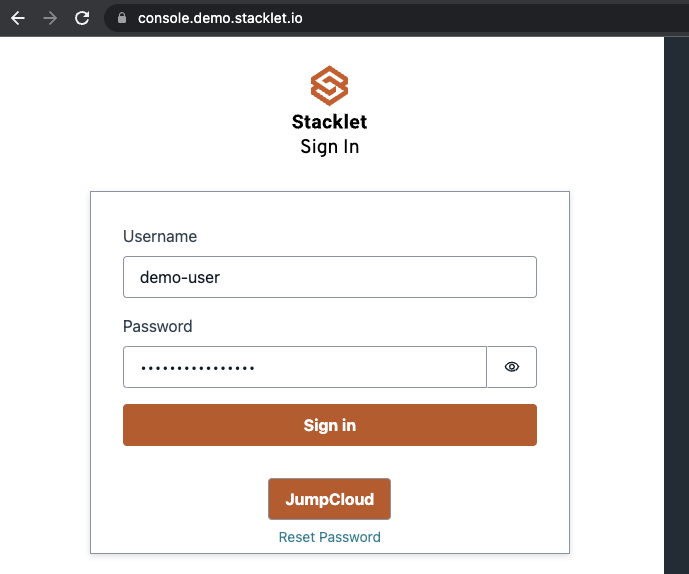

# Deploying Policies

Now that policies are authored you need to bind them to your account(s) and check the results. 

Browse to Stacklet Platform and log in:

# Adding a Policy Repository

Log into the Stacklet Platform that was shared with you then browse to `Admin > Controls > Repositories` then hit the `Add Repository` button. 

Use the following parameters to add the repository: 

* Name: `Workshop Policies`
* URL: `https://github.com/stacklet/aws-workshop`
* Branch name: `main`
* Policy Directories: `01-policy-authoring/runtime`

Leave everything else as default, and click the `add` button. 

Now browse to the repository, go to the `Policies` button and refresh the page until the policies appear. 

# Creating a policy collection

All policies are now loaded in the library. You can now organize them in a Policy Collection. Browse to `Admin > Controls > Policies` and filter the policies by typing `provider:aws` in the search bar. 

Select all of them, and hit the `Add to Collection` button.

In the pop up window, note the `Automatically Update` check box. If you tick this box, then changes made to policies in the repository will automatically make their way to the collection. This is equivalent to a `docker-image:latest` reference basically. 

# Creating an Account Group

Browse to `Admin > Clouds > Accounts` where you will find the AWS Account you added previously. Select it and use the `Add to group` button to create a new account group. 
Make sure to select the regions where you previously deployed the CloudFormation stack. 

# Binding Policies to Accounts

The final step of the configuration is bind the policy collection to an account group. Browse to `Admin > Orchestration > Bindings`. Select it and use the `Create new` button and fill in the details. 

Select 
* `one hour` schedule
* Leave `Variables` empty. Variables can be used to adjust the behaviour of policies according. For example, it can be used to adjust the retention duration of snapshots depending on the environment
* Leave `Security Context` empty as well. The binding will use the default Read Only IAM Role set up for Stacklet in your account. This setting can be used in production to apply least privilege access to policies
* Enable notifications add an `email` integration, with an `instant` frequency and pick the `email.j2` template. For recipients, add `your own personal email address`. 
* Tick `Deploy`, `Automatically Update` and `Dry Run` 
  * Deploy will start executing the binding right away
  * Automatically update is equivalent to a `imagePullPolicy = Always` in Kubernetes. The binding will redeploy the latest and greatest policy as soon as a new version is available
  * Dry Run won't do anything for us right now, but it is a safe mode. In case some policies had actions, it would not execute them. 

The binding will take a few seconds to deploy, time for the platform to hook all the things together. 

As the Security stakeholder, you now have a layer of protection in your accounts that will notify you in case any of the aformentioned situations arise: non encrypted EFS drive, RDS, or misconfigured ELB. 

[Next Step](../03-infrastructure-deployment/README.md) | [Back to Top](../README.md)